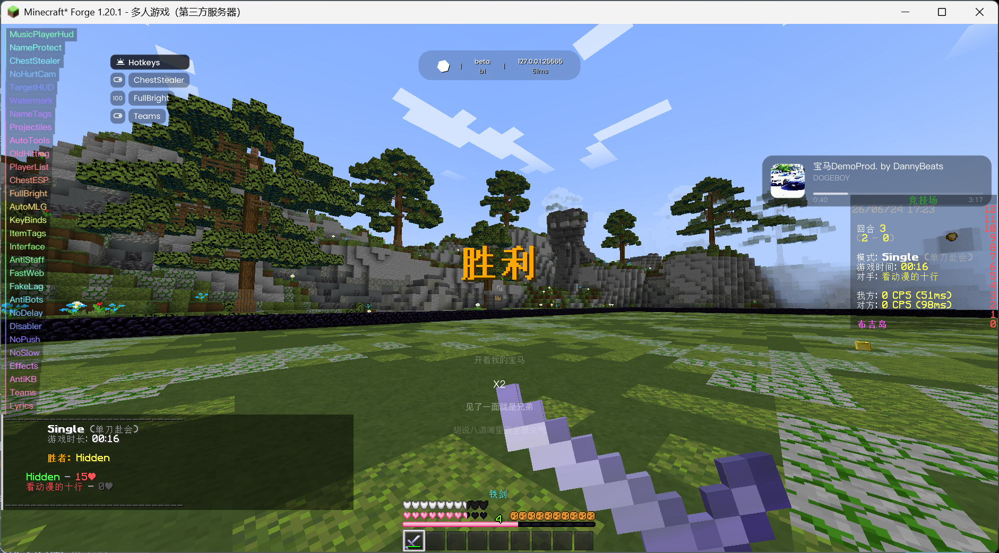

# Open Nilore

> ⚠️ 本仓库**仅供学习与研究目的发布** —— 用于研究客户端侧游戏改造、ASM 字节码补丁和混淆/反混淆技术。在你不拥有的服务器上使用作弊客户端违反绝大多数服务器规则，请自行承担后果。

## 截图


## 技术原理

### 注入方式

Open Nilore 支持两种注入方式：

**Java Agent 注入：**
```
JVM 启动参数 -javaagent → PatchAgent.premain() → 注册 ClassFileTransformer → 类加载时拦截并修改字节码
```

**DLL 注入：**
```
OpenNiloreLoader.exe → 注入 OpenZen.dll 到 javaw.exe → JNI 调用 Agent_OnAttach → Bootstrap.init() → SRG mapping → 注册所有 patch
```

### ASM Patching 框架

框架位于 `src/main/java/asm/patchify/`，提供注解驱动的字节码修改 API：

| 注解 | 用途 |
|------|------|
| `@Patch` | 标记目标类 |
| `@Inject` | 在方法指定位置注入代码 |
| `@Transform` | 修改已有方法字节码 |
| `@Overwrite` | 完全替换方法体 |
| `@WrapInvoke` | 包装方法调用 |
| `@Accessor` | 访问私有字段/方法 |
| `@Local` | 捕获局部变量 |

**加载流程：**
1. `PatchAgent`（Java Agent premain）或 `Bootstrap`（DLL 注入后）启动
2. `ClassAgent` 扫描所有 `@Patch` 注解的类
3. `PatchClassFileTransformer` 注册到 `Instrumentation`
4. 类加载时 `PatchTransformer` 按优先级应用所有匹配的补丁

### 事件系统

自定义事件总线 (`shit.nilore.event`)，支持优先级排序和事件取消。模块启用时自动注册 `@EventTarget` 方法，禁用时自动注销。

```java
@EventTarget(priority = EventPriority.HIGH)
public void onPacket(PacketEvent event) {
    if (event.getPacket() instanceof ServerboundMovePacket) {
        event.setCancelled(true);
    }
}
```

支持 ~35 种事件类型，覆盖游戏 tick、渲染、网络包、移动等各个方面。

### 模块系统

模块基类 `Module` 提供：
- 自动发现所有 `Setting<?>` 字段（反射扫描）
- `onEnable()` / `onDisable()` 生命周期
- 通过 `ModuleManager.initModules()` 手动注册

分类：COMBAT, MOVEMENT, PLAYER, RENDER, EXPLOIT, WORLD, MISC

### Native 层

**DLL (`native/dll/`)：**
- 使用 JNI 调用 `Agent_OnAttach` 注入 Java Agent
- 嵌入 `nilore.jar` 作为资源段，运行时提取到临时目录加载

**Loader (`native/loader/`)：**
- Qt6 GUI 应用（静态链接，零运行时依赖）
- 列出所有 `javaw.exe` 进程，读取 Minecraft 窗口标题
- 使用 `CreateRemoteThread` + `LoadLibrary` 注入 DLL
- DLL 作为 RCDATA 嵌入 EXE，分发只需单文件

## 构建

Open Nilore 支持两种交付形式：**Java Agent jar**（挂到 Minecraft JVM 启动参数里）和 **热注入器 (单文件 EXE，内嵌 DLL)**。Agent 路径只要 JDK，注入器路径还需要 MSVC 工具链。

> **本项目不能作为 Forge mod 启动。** `mods/` 加载路径不被支持，不要把 jar 丢进 `.minecraft/mods/`。

### 编译时类名混淆（重要）

每次构建，Open Nilore 会**自动把所有自有类(`shit.nilore.*` / `asm.patchify.*`)重命名为随机的 16 位名字**——包名和类名都随机，**每次构建都不一样**、互不重复，原始类名/包名一律不保留（连日志里残留的类名字符串也清理掉了）。引导链（Agent 入口、DLL 加载、`Class.forName`）会在构建时自动联动到新名字，无需手工处理。两种交付形式（jar / 注入器）都已混淆。

这是为了对抗按**类名黑名单**工作的反作弊（见下方[常见问题](#布吉岛反作弊绕过)）。正因为名字每次构建随机：

> ⚠️ **从 GitHub Actions / Release 下载到的是预编译版本，所有人拿到的是同一套混淆名**——这套固定的名字随时可能被反作弊收录进黑名单。想要一套**别人都不知道、独一无二**的类名，请**自己编译**：
> - **Fork 本仓库**，在你自己的 GitHub Actions 里跑一次构建（每次运行都生成全新随机名），下载你自己的 artifact；**或**
> - **clone 到本地**自己 `gradlew jar` / `gradlew dll`（每次本地构建同样是全新随机名）。

每次构建的"旧名 → 新名"映射写在 `build/rename-mapping.txt`（CI 也会把它作为 artifact 上传、并附到 Release），这是反混淆崩溃日志的**唯一**依据。**注意它每次构建都不同，务必和对应产物一起保存。**

实现细节见 `build.gradle` 的 `ext.obfuscateJar`：用项目自带的 ASM 在 ForgeGradle `reobf` 之后对产出 jar 做 `ClassRemapper` 重命名，**只改类名、不动方法/字段名**（避免破坏反射、JNI、`@SerializedName` 等）。

### 共同前置

- **JDK 17**（推荐 Microsoft Build of OpenJDK / Temurin / Azul Zulu 任一）。
- 必须设置 `JAVA_HOME` 环境变量指向该 JDK 安装目录（PowerShell 验证：`echo $env:JAVA_HOME`）。
- 仓库根目录用 `gradlew.bat` 即可，**不需要**单独安装 Gradle。
- **可选：UPX** —— 仅热注入器路径会用到，作用是把最终的 `OpenNiloreLoader.exe` 从 ~32 MB 压到 ~10 MB。在 `PATH` 上检测到 `upx` 时 `./gradlew upxCompress` 会自动跑 `--best --lzma`；找不到就只打一条 warning 直接跳过，不影响功能。安装方式：

    ```powershell
    choco install upx -y
    ```

    或者从 <https://upx.github.io/> 下载 ZIP 并把 `upx.exe` 加进 `PATH`。

首次执行会从 ForgeMaven 下载 1.20.1 + Forge 47.4.20 的 mappings 和依赖，耗时几分钟到十几分钟，取决于网络。

### 1. 构建为 Java Agent jar

零额外依赖。

```powershell
.\gradlew.bat jar
```

产物：`build/libs/hey-1.0.jar`。在 Forge 启动器的 JVM 启动参数里加上：

```
-javaagent:"完整\路径\到\hey-1.0.jar" -Djdk.attach.allowAttachSelf=true
```

`PatchAgent.premain` 会在 Minecraft 类加载之前装载所有 ASM 补丁；`-Djdk.attach.allowAttachSelf=true` 是让 `installPatchesAndRetransform` 在需要时能兜底走 Attach API。

### 2. 构建为热注入器 (单文件 EXE)

产出一个独立的 `OpenNiloreLoader.exe`，DLL 已经作为资源段嵌入 EXE 内部。用户分发只需要这一个文件，运行后 GUI 列出当前所有 `javaw.exe` 进程（含 Minecraft 窗口标题），选中后点 Inject 即可。

#### 额外前置 — 必须项

1. **Visual Studio 2022**（Community 版即可，免费）。安装时勾选：
    - **"使用 C++ 的桌面开发"** 工作负载
    - 该工作负载的可选组件里勾上 **"适用于 Windows 的 C++ CMake 工具"**（"C++ CMake tools for Windows"）
2. **`JAVA_HOME` 必须指向 JDK 17**（不只是 JRE）。CMake 需要它定位 `<JAVA_HOME>/include/jni.h` 和 `<JAVA_HOME>/include/win32/jvmti.h`。
3. **CMake**：VS 2022 自带，Gradle 会自动检测——也可以独立安装 [CMake](https://cmake.org/download/) 并加入 PATH。Gradle 的检测顺序：
    1. `PATH` 上的 `cmake.exe`
    2. 通过 `vswhere.exe` 找 VS 2022 自带的 CMake
    3. 常见独立安装位置 (`%ProgramFiles%\CMake\bin\cmake.exe` 等)
4. **vcpkg**（注入器 GUI 用 Qt6，由 vcpkg 提供静态库）。一次性安装：

    ```powershell
    git clone https://github.com/microsoft/vcpkg.git C:\vcpkg
    C:\vcpkg\bootstrap-vcpkg.bat
    ```

    Gradle 检测顺序：环境变量 `VCPKG_ROOT` → `C:\vcpkg` → `D:\vcpkg` → `%USERPROFILE%\vcpkg`。
    **首次** `./gradlew dll` 时 vcpkg 会按 `native/vcpkg.json` 编译静态 Qt6（30 分钟到 2 小时，看 CPU），之后增量 build 几分钟。Qt 完全静态链接进 EXE，所以分发依然单文件——`OpenNiloreLoader.exe` 自带 Qt6 + OpenZen.dll，零运行时依赖。

#### 构建命令

```powershell
.\gradlew.bat dll
```

产物：`build/dist/OpenNiloreLoader.exe`。如果已装 UPX 想顺便压缩，跑 `.\gradlew.bat upxCompress`。

#### 使用注入器

1. 用 HMCL / Forge 启动器正常启动 Minecraft 1.20.1 Forge（**不需要**任何特殊 JVM 参数）。
2. 双击 `OpenNiloreLoader.exe`。
3. GUI 自动列出系统里**所有 Minecraft 实例**，每秒自动刷新一次。
4. 点击行最后的 Inject 按钮。

诊断日志：
- Native 端：`%TEMP%\openzen.log`
- Java 端：Minecraft 自己的 `logs/latest.log`（类名已被构建时混淆、logger 名是随机的，改用固定日志文案定位，如 `bootstrap.start`、`bridge.load`、`agent attached`、`Runtime mapping`）

## 常见问题

### 布吉岛反作弊绕过

类名已黑名单。现在**每次构建都会自动随机化全部类名**（见上方[编译时类名混淆](#编译时类名混淆重要)）——但**务必自己 Fork/clone 编译**，别直接用 GitHub Actions / Release 上的预编译版：那是固定的一套名字，会被拉黑。
